# 🔄 Auro Connect CI Pipeline

## 📋 Pipeline Overview

The Auro Connect CI pipeline is organized into **9 distinct stages** that run in a logical sequence to ensure code quality, functionality, and performance for the entire monorepo:

### Pipeline Stages

1. **📦 Setup & Dependencies** - Install and cache all project dependencies for both frontend and backend
2. **🔍 Lint & Code Quality** - Run ESLint and code quality checks on both frontend and backend
3. **🧪 Unit Tests** - Execute unit tests with coverage reporting for both frontend and backend
4. **🔗 Integration Tests** - Run API and component integration tests for both frontend and backend
5. **📸 Snapshot Tests** - Verify component rendering consistency for both frontend and backend
6. **🧠 Memory Leak Tests** - Detect memory leaks in frontend applications
7. **⚡ Performance Tests** - Run performance and Lighthouse audits on frontend
8. **🎭 End-to-End Tests** - Full application workflow testing across the entire stack
9. **📋 Test Summary & Reporting** - Generate comprehensive test reports

## 🎛️ Manual Controls

You can trigger the workflow manually and skip specific stages:

1. Go to the "Actions" tab in GitHub
2. Select "🔄 Continuous Integration"
3. Click "Run workflow"
4. Toggle the stages you want to skip:
   - Skip Linting
   - Skip Unit Tests
   - Skip Integration Tests
   - Skip Snapshot Tests
   - Skip Memory Leak Tests
   - Skip Performance Tests
   - Skip End-to-End Tests

## 📊 Artifacts & Reports

Each stage generates specific artifacts that are stored for 30 days:

- **Lint Results**: ESLint reports in JSON format for both frontend and backend
- **Coverage Reports**: HTML and LCOV coverage reports for both frontend and backend
- **Test Results**: JUnit XML test results for both frontend and backend
- **Integration Test Results**: Frontend Playwright and backend Jest integration test reports
- **Snapshots**: Component and API snapshot files for both frontend and backend
- **Performance Reports**: Lighthouse reports and performance metrics
- **E2E Reports**: Playwright HTML reports and screenshots
- **Server Logs**: Backend and frontend server logs for debugging

## 🔔 Notifications

The pipeline sends Slack notifications to the `#auro-connect` channel:

- ✅ Success notifications for each stage
- 🟡 Warning for pipeline completion with failures
- ❌ Critical failure notifications
- 📋 Detailed summary with all stage results

## 🚀 Execution Flow

```mermaid
graph TD
    A[📦 Setup & Dependencies] --> B[🔍 Lint & Code Quality]
    B --> C[🧪 Unit Tests]
    C --> D[🔗 Integration Tests]
    B --> E[📸 Snapshot Tests]
    D --> F[🧠 Memory Leak Tests]
    D --> G[⚡ Performance Tests]
    D --> E
    E --> H[🎭 End-to-End Tests]
    F --> I[📋 Test Summary & Reporting]
    G --> I
    H --> I
```

## 🔧 Dependencies Between Stages

- **Lint**: Depends on Setup
- **Unit Tests**: Depends on Setup + Lint
- **Integration Tests**: Depends on Setup + Lint + Unit Tests
- **Snapshot Tests**: Depends on Setup + Lint + Integration Tests
- **Memory Leak Tests**: Depends on Setup + Lint + Unit Tests + Integration Tests
- **Performance Tests**: Depends on Setup + Lint + Unit Tests + Integration Tests
- **E2E Tests**: Depends on Setup + Lint + Unit Tests + Integration Tests + Snapshot Tests
- **Test Summary**: Depends on all previous stages

## 📋 Available Scripts

### Root Scripts (Monorepo)
- `npm run build` - Build both frontend and backend
- `npm run test` - Run tests for both frontend and backend
- `npm run test:coverage` - Run coverage tests for both frontend and backend

### Frontend Scripts
- `npm run lint:check` - ESLint check
- `npm run test:ci` - Unit tests for CI
- `npm run test:integration:ci` - Integration tests for CI
- `npm run test:snapshot:ci` - Snapshot tests for CI
- `npm run test:memory-leaks:ci` - Memory leak tests
- `npm run test:perf:ci` - Performance tests
- `npm run test:lighthouse:ci` - Lighthouse audits
- `npm run test:e2e:ci` - E2E tests

### Backend Scripts
- `npm run lint:check` - ESLint check
- `npm run test:coverage` - Unit tests with coverage
- `npm run test:snapshot:ci` - Snapshot tests
- `npm run test:integration:ci` - Integration tests for CI
- `npm start` - Start production server

## 🎯 Best Practices

1. **Fail Fast**: Linting runs early to catch code quality issues
2. **Unified Testing**: Frontend and backend are tested together as a cohesive monorepo
3. **Comprehensive Coverage**: All aspects from unit tests to E2E tests are covered
4. **Artifact Preservation**: All test results and reports are preserved for analysis
5. **Slack Integration**: Real-time notifications keep the team informed

## 🏗️ Monorepo Architecture

The pipeline now treats the project as a unified monorepo:
- **Single Setup Stage**: Installs dependencies for both frontend and backend
- **Unified Stages**: Each testing stage runs both frontend and backend tests
- **Combined Artifacts**: Artifacts are organized by component (frontend/backend) but managed centrally
- **Holistic Reporting**: Test summary provides a complete view of the entire application 