# 🔄 Auro Connect CI Pipeline

## 📋 Pipeline Overview

The Auro Connect CI pipeline is organized into **9 distinct stages** that run in a logical sequence to ensure code quality, functionality, and performance:

### Pipeline Stages

1. **📦 Setup & Dependencies** - Install and cache all project dependencies
2. **🔍 Lint & Code Quality** - Run ESLint and code quality checks
3. **🧪 Unit Tests** - Execute unit tests with coverage reporting
4. **🔗 Integration Tests** - Run API and component integration tests
5. **📸 Snapshot Tests** - Verify component rendering consistency
6. **🧠 Memory Leak Tests** - Detect memory leaks in frontend applications
7. **⚡ Performance Tests** - Run performance and Lighthouse audits
8. **🎭 End-to-End Tests** - Full application workflow testing
9. **📋 Test Summary & Reporting** - Generate comprehensive test reports

## 🎛️ Manual Controls

You can trigger the workflow manually and skip specific stages:

1. Go to the "Actions" tab in GitHub
2. Select "🔄 Continuous Integration"
3. Click "Run workflow"
4. Toggle the stages you want to skip:
   - Skip Linting
   - Skip Unit Tests
   - Skip Integration Tests
   - Skip Snapshot Tests
   - Skip Memory Leak Tests
   - Skip Performance Tests
   - Skip End-to-End Tests

## 📊 Artifacts & Reports

Each stage generates specific artifacts that are stored for 30 days:

- **Lint Results**: ESLint reports in JSON format
- **Coverage Reports**: HTML and LCOV coverage reports
- **Test Results**: JUnit XML test results
- **Integration Test Results**: Frontend Playwright and backend Jest integration test reports
- **Snapshots**: Component and API snapshot files
- **Performance Reports**: Lighthouse reports and performance metrics
- **E2E Reports**: Playwright HTML reports and screenshots
- **Server Logs**: Backend and frontend server logs for debugging

## 🔔 Notifications

The pipeline sends Slack notifications to the `#auro-connect` channel:

- ✅ Success notifications for each stage
- 🟡 Warning for pipeline completion with failures
- ❌ Critical failure notifications
- 📋 Detailed summary with all stage results

## 🚀 Execution Flow

```mermaid
graph TD
    A[📦 Setup & Dependencies] --> B[🔍 Lint & Code Quality]
    B --> C[🧪 Unit Tests]
    C --> D[🔗 Integration Tests]
    B --> E[📸 Snapshot Tests]
    D --> F[🧠 Memory Leak Tests]
    D --> G[⚡ Performance Tests]
    D --> E
    E --> H[🎭 End-to-End Tests]
    F --> I[📋 Test Summary & Reporting]
    G --> I
    H --> I
```

## 🔧 Dependencies Between Stages

- **Lint**: Depends on Setup
- **Unit Tests**: Depends on Setup + Lint
- **Integration Tests**: Depends on Setup + Lint + Unit Tests
- **Snapshot Tests**: Depends on Setup + Lint + Integration Tests
- **Memory Leak Tests**: Depends on Setup + Lint + Unit Tests + Integration Tests
- **Performance Tests**: Depends on Setup + Lint + Unit Tests + Integration Tests
- **E2E Tests**: Depends on Setup + Lint + Unit Tests + Integration Tests + Snapshot Tests
- **Test Summary**: Depends on all previous stages

## 📋 Available Scripts

### Frontend Scripts
- `npm run lint:check` - ESLint check
- `npm run test:ci` - Unit tests for CI
- `npm run test:integration:ci` - Integration tests for CI
- `npm run test:snapshot:ci` - Snapshot tests for CI
- `npm run test:memory-leaks:ci` - Memory leak tests
- `npm run test:perf:ci` - Performance tests
- `npm run test:lighthouse:ci` - Lighthouse audits
- `npm run test:e2e:ci` - E2E tests

### Backend Scripts
- `npm run lint:check` - ESLint check
- `npm run test:coverage` - Unit tests with coverage
- `npm run test:snapshot:ci` - Snapshot tests
- `npm start` - Start production server

## 🎯 Best Practices

1. **Fail Fast**: Linting runs early to catch code quality issues
2. **Parallel Execution**: Independent stages run in parallel for efficiency
3. **Resource Management**: Servers are properly started and cleaned up
4. **Artifact Retention**: Important test results are preserved for debugging
5. **Clear Visibility**: Each stage has distinct names and purposes
6. **Flexible Execution**: Individual stages can be skipped when needed
7. **Comprehensive Reporting**: Detailed summaries show overall pipeline health

## 🐛 Troubleshooting

### Common Issues
1. **Memory Leak Tests Failing**: Check if servers are starting properly
2. **E2E Tests Timeout**: Increase server startup wait time
3. **Performance Tests Inconsistent**: Run on dedicated CI runners
4. **Artifacts Missing**: Check artifact upload paths and retention settings

### Debugging Steps
1. Check server logs in artifacts
2. Review Playwright reports for visual debugging
3. Examine coverage reports for test completeness
4. Use Slack notifications to identify failing stages quickly 