# 🔄 CI Workflow Documentation

## Overview

The Auro Connect CI pipeline is organized into 8 clear stages that run sequentially, with some stages running in parallel for efficiency. Each stage has a specific purpose and can be skipped individually using workflow dispatch inputs.

## 🏗️ Pipeline Stages

### Stage 1: 📦 Setup & Dependencies
- **Purpose**: Install all dependencies for frontend and backend
- **Components**: Root, Frontend, Backend
- **Cache Strategy**: Uses Node.js cache and custom caching for node_modules
- **Skip Option**: Cannot be skipped (required for all other stages)

### Stage 2: 🔍 Lint & Code Quality
- **Purpose**: Run ESLint checks for code quality and style compliance
- **Components**: Frontend, Backend (parallel execution)
- **Skip Option**: `skip_lint`
- **Artifacts**: Lint results for each component

### Stage 3: 🧪 Unit Tests
- **Purpose**: Run unit and integration tests with coverage
- **Components**: Frontend, Backend (parallel execution)
- **Skip Option**: `skip_unit_tests`
- **Artifacts**: Coverage reports, test results

### Stage 4: 📸 Snapshot Tests
- **Purpose**: Run snapshot tests to detect UI/API changes
- **Components**: Frontend, Backend (parallel execution)
- **Skip Option**: `skip_snapshot_tests`
- **Artifacts**: Snapshot files, test results

### Stage 5: 🧠 Memory Leak Tests
- **Purpose**: Detect memory leaks in the frontend application
- **Components**: Frontend only
- **Skip Option**: `skip_memory_leak_tests`
- **Artifacts**: Memory leak reports, server logs
- **Requirements**: Requires both frontend and backend servers running

### Stage 6: ⚡ Performance Tests
- **Purpose**: Run performance tests and Lighthouse audits
- **Components**: Frontend only
- **Skip Option**: `skip_performance_tests`
- **Artifacts**: Performance reports, Lighthouse reports, server logs
- **Requirements**: Requires both frontend and backend servers running

### Stage 7: 🎭 End-to-End Tests
- **Purpose**: Run full end-to-end tests across the application
- **Components**: Full Stack
- **Skip Option**: `skip_e2e_tests`
- **Artifacts**: E2E test results, Playwright reports, server logs
- **Requirements**: Requires both frontend and backend servers running

### Stage 8: 📋 Test Summary & Reporting
- **Purpose**: Aggregate results and send notifications
- **Components**: All
- **Skip Option**: Cannot be skipped
- **Artifacts**: Combined coverage, test summary, all previous artifacts

## 🎛️ Manual Controls

You can trigger the workflow manually and skip specific stages:

1. Go to the "Actions" tab in GitHub
2. Select "🔄 Continuous Integration"
3. Click "Run workflow"
4. Toggle the stages you want to skip:
   - Skip Linting
   - Skip Unit Tests
   - Skip Snapshot Tests
   - Skip Memory Leak Tests
   - Skip Performance Tests
   - Skip End-to-End Tests

## 📊 Artifacts & Reports

Each stage generates specific artifacts that are stored for 30 days:

- **Lint Results**: ESLint reports in JSON format
- **Coverage Reports**: HTML and LCOV coverage reports
- **Test Results**: JUnit XML test results
- **Snapshot Files**: Jest/Playwright snapshot files
- **Performance Reports**: Lighthouse reports and performance metrics
- **E2E Reports**: Playwright HTML reports and screenshots
- **Server Logs**: Backend and frontend server logs for debugging

## 🔔 Notifications

The pipeline sends Slack notifications to the `#auro-connect` channel:

- ✅ Success notifications for each stage
- 🟡 Warning for pipeline completion with failures
- ❌ Critical failure notifications
- 📋 Detailed summary with all stage results

## 🚀 Execution Flow

```mermaid
graph TD
    A[📦 Setup & Dependencies] --> B[🔍 Lint & Code Quality]
    B --> C[🧪 Unit Tests]
    B --> D[📸 Snapshot Tests]
    C --> E[🧠 Memory Leak Tests]
    C --> F[⚡ Performance Tests]
    D --> G[🎭 End-to-End Tests]
    E --> H[📋 Test Summary & Reporting]
    F --> H
    G --> H
```

## 🔧 Dependencies Between Stages

- **Lint**: Depends on Setup
- **Unit Tests**: Depends on Setup + Lint
- **Snapshot Tests**: Depends on Setup + Lint
- **Memory Leak Tests**: Depends on Setup + Lint + Unit Tests
- **Performance Tests**: Depends on Setup + Lint + Unit Tests
- **E2E Tests**: Depends on Setup + Lint + Unit Tests + Snapshot Tests
- **Test Summary**: Depends on all previous stages

## 📋 Available Scripts

### Frontend Scripts
- `npm run lint:check` - ESLint check
- `npm run test:ci` - Unit tests with coverage
- `npm run test:snapshot:ci` - Snapshot tests
- `npm run test:memory-leaks:ci` - Memory leak tests
- `npm run test:perf:ci` - Performance tests
- `npm run test:lighthouse:ci` - Lighthouse audits
- `npm run test:e2e:ci` - E2E tests

### Backend Scripts
- `npm run lint:check` - ESLint check
- `npm run test:coverage` - Unit tests with coverage
- `npm run test:snapshot:ci` - Snapshot tests
- `npm start` - Start production server

## 🎯 Best Practices

1. **Fail Fast**: Linting runs early to catch code quality issues
2. **Parallel Execution**: Independent stages run in parallel for efficiency
3. **Resource Management**: Servers are properly started and cleaned up
4. **Artifact Retention**: Important test results are preserved for debugging
5. **Clear Visibility**: Each stage has distinct names and purposes
6. **Flexible Execution**: Individual stages can be skipped when needed
7. **Comprehensive Reporting**: Detailed summaries show overall pipeline health

## 🐛 Troubleshooting

### Common Issues
1. **Memory Leak Tests Failing**: Check if servers are starting properly
2. **E2E Tests Timeout**: Increase server startup wait time
3. **Performance Tests Inconsistent**: Run on dedicated CI runners
4. **Artifacts Missing**: Check artifact upload paths and retention settings

### Debugging Steps
1. Check server logs in artifacts
2. Review Playwright reports for visual debugging
3. Examine coverage reports for test completeness
4. Use Slack notifications to identify failing stages quickly 