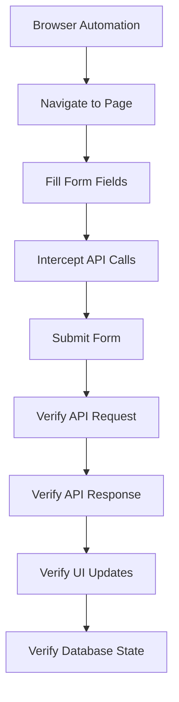
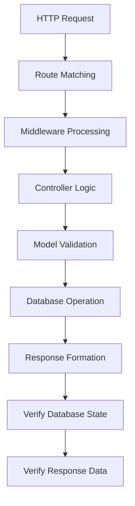

# 🔗 Integration Testing Documentation

## What is Integration Testing?

Integration testing verifies that different components, modules, or systems work correctly when combined together. Unlike unit tests that test individual functions in isolation, integration tests ensure that the **interaction between components** works as expected.

## 🎯 Integration Test Coverage

### **Frontend Integration Tests** (`frontend/tests/integration/`)

**File**: `auth.integration.test.js`

Tests the complete integration between:
- ✅ **Frontend React Components** ↔ **Backend APIs**
- ✅ **UI Actions** ↔ **API Requests** ↔ **Database Operations**
- ✅ **Error Handling** across the full stack
- ✅ **Authentication Flow** from UI to Database
- ✅ **Session Management** and token handling

#### **Test Scenarios:**

1. **Signup Integration Flow**
   ```
   UI Form → API Request → Backend Validation → Database Save → Response → UI Update
   ```

2. **Login Integration Flow**
   ```
   UI Form → API Request → Database Lookup → JWT Generation → Response → Session Storage
   ```

3. **Protected Routes Integration**
   ```
   Page Navigation → Token Validation → API Call → Database Query → UI Rendering
   ```

4. **Error Handling Integration**
   ```
   API Error → Backend Response → Frontend Error Display → User Feedback
   ```

### **Backend Integration Tests** (`backend/tests/integration/`)

**File**: `auth.integration.test.js`

Tests the complete integration between:
- ✅ **Express Routes** ↔ **Controllers** ↔ **Database Models**
- ✅ **Middleware** ↔ **Authentication Logic** ↔ **JWT Processing**
- ✅ **Database Operations** ↔ **Data Validation** ↔ **Response Formatting**
- ✅ **Security Features** across the backend stack

#### **Test Scenarios:**

1. **API Endpoint Integration**
   ```
   HTTP Request → Route Handler → Controller Logic → Model Validation → Database → Response
   ```

2. **Authentication Middleware Integration**
   ```
   Request → JWT Verification → User Lookup → Route Access → Protected Operation
   ```

3. **Database Integration**
   ```
   Controller → Model → MongoDB → Validation → Constraints → Response
   ```

4. **Security Integration**
   ```
   Input → Sanitization → Validation → Hashing → Storage → Verification
   ```

## 🚀 Running Integration Tests

### **Frontend Integration Tests**

```bash
# Run all frontend integration tests
npm run test:integration

# Run with browser visible (for debugging)
npm run test:integration:headed

# Run for CI/CD pipeline
npm run test:integration:ci

# Run specific test file
npx playwright test tests/integration/auth.integration.test.js
```

### **Backend Integration Tests**

```bash
# Run all backend integration tests
npm run test:integration

# Run in watch mode for development
npm run test:integration:watch

# Run for CI/CD pipeline
npm run test:integration:ci

# Run specific test file
npm test tests/integration/auth.integration.test.js
```

## 📊 Integration Test Structure

### **Frontend Integration Test Flow**



### **Backend Integration Test Flow**



## 🔍 What Integration Tests Verify

### **Frontend Integration Tests Verify:**

1. **API Communication**
   - Request payload structure
   - Response handling
   - Error response processing
   - Network failure handling

2. **UI-Backend Integration**
   - Form submission to API
   - Loading states during API calls
   - Success/error message display
   - Page redirections after API responses

3. **Authentication Flow**
   - Signup → API → Database → Redirect
   - Login → API → JWT → Session Storage
   - Protected Routes → Token Validation → Access

4. **Data Persistence**
   - User creation via UI persists in database
   - Login credentials are verified against database
   - User sessions are maintained across page loads

### **Backend Integration Tests Verify:**

1. **Route-Controller Integration**
   - Routes correctly call controller methods
   - Controllers handle different HTTP methods
   - Response status codes and formats

2. **Controller-Model Integration**
   - Controllers properly use models
   - Model validation is applied
   - Database operations are successful

3. **Middleware Integration**
   - Authentication middleware works with routes
   - Request validation is applied
   - Error handling middleware catches errors

4. **Database Integration**
   - Models correctly interact with MongoDB
   - Constraints and validations work
   - Data is properly saved and retrieved

5. **Security Integration**
   - Password hashing with bcrypt
   - JWT token generation and verification
   - Input sanitization and validation

## 🛠️ Integration Test Features

### **Advanced Testing Techniques:**

1. **API Interception**
   ```javascript
   // Intercept and verify API calls
   await page.route('/api/auth/login', (route) => {
     const request = route.request();
     const payload = JSON.parse(request.postData());
     expect(payload.username).toBe(expectedUsername);
     route.continue();
   });
   ```

2. **Database Verification**
   ```javascript
   // Verify data persisted to database
   const userInDb = await User.findById(userId);
   expect(userInDb.email).toBe(testUser.email);
   ```

3. **JWT Testing**
   ```javascript
   // Verify JWT token is valid
   const decodedToken = jwt.verify(token, process.env.JWT_SECRET);
   expect(decodedToken.userId).toBe(expectedUserId);
   ```

4. **Security Testing**
   ```javascript
   // Test NoSQL injection prevention
   const maliciousInput = { $ne: null };
   const response = await request(app)
     .post('/api/auth/login')
     .send({ username: maliciousInput });
   expect(response.status).toBe(401);
   ```

## 📋 Integration vs Other Test Types

| Test Type | Scope | Speed | Complexity | Confidence |
|-----------|-------|-------|------------|------------|
| **Unit Tests** | Individual functions | ⚡ Fast | 🟢 Low | 🟡 Medium |
| **Integration Tests** | Component interactions | 🟡 Medium | 🟡 Medium | 🟢 High |
| **E2E Tests** | Complete user workflows | 🔴 Slow | 🔴 High | 🟢 Very High |

## 🎯 Integration Test Best Practices

### **1. Test Real Interactions**
```javascript
// ✅ Good: Test actual API calls
const response = await request(app).post('/api/auth/signup').send(userData);

// ❌ Bad: Mock everything
const mockApi = jest.fn().mockReturnValue({ success: true });
```

### **2. Use Real Database Operations**
```javascript
// ✅ Good: Verify data in actual database
const userInDb = await User.findById(userId);
expect(userInDb.email).toBe(testUser.email);

// ❌ Bad: Mock database operations
const mockDb = jest.fn().mockReturnValue(mockUser);
```

### **3. Test Error Scenarios**
```javascript
// ✅ Good: Test error handling integration
const response = await request(app)
  .post('/api/auth/signup')
  .send({ email: 'invalid-email' });
expect(response.status).toBe(400);
```

### **4. Clean Up Test Data**
```javascript
// ✅ Good: Clean up after each test
afterEach(async () => {
  if (userId) {
    await User.findByIdAndDelete(userId);
  }
});
```

## 🔧 Configuration

### **Frontend Integration Test Config**
- Uses Playwright for browser automation
- Configured to test against real backend API
- Includes network interception and verification
- Supports multiple browsers and devices

### **Backend Integration Test Config**
- Uses Jest with Supertest for HTTP testing
- Connects to test database (MongoDB Memory Server)
- Includes real JWT and bcrypt operations
- Tests actual middleware and route handling

## 🐛 Debugging Integration Tests

### **Frontend Debugging:**
```bash
# Run with browser visible
npm run test:integration:headed

# Use Playwright debug mode
npx playwright test tests/integration/auth.integration.test.js --debug
```

### **Backend Debugging:**
```bash
# Run specific test with verbose output
npm test tests/integration/auth.integration.test.js -- --verbose

# Run in watch mode for development
npm run test:integration:watch
```

## 📈 CI/CD Integration

Integration tests are included in the CI pipeline:

- **Stage 3**: Unit Tests (includes basic integration)
- **Stage 4**: Integration Tests (dedicated integration testing)
- **Stage 7**: E2E Tests (full user workflow testing)

The integration tests provide a crucial middle layer of testing confidence, ensuring that components work together correctly before running expensive E2E tests.

## ✅ Integration Test Checklist

When adding new features, ensure integration tests cover:

- [ ] **API Request/Response Flow** - Frontend to Backend communication
- [ ] **Database Operations** - Data persistence and retrieval
- [ ] **Authentication Integration** - Login/logout/protected routes
- [ ] **Error Handling** - Error propagation across layers
- [ ] **Security Features** - Input validation, sanitization, authentication
- [ ] **Middleware Integration** - CORS, rate limiting, validation
- [ ] **Session Management** - Token generation, validation, expiration

## 🎉 Benefits of Integration Testing

1. **Catch Interface Issues** - Find problems where components meet
2. **Verify Data Flow** - Ensure data moves correctly between layers
3. **Test Real Scenarios** - Use actual databases and APIs
4. **Build Confidence** - Higher confidence than unit tests alone
5. **Fast Feedback** - Faster than full E2E tests
6. **Regression Detection** - Catch breaking changes in component interactions 